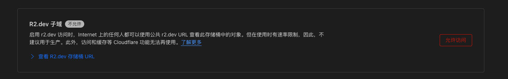
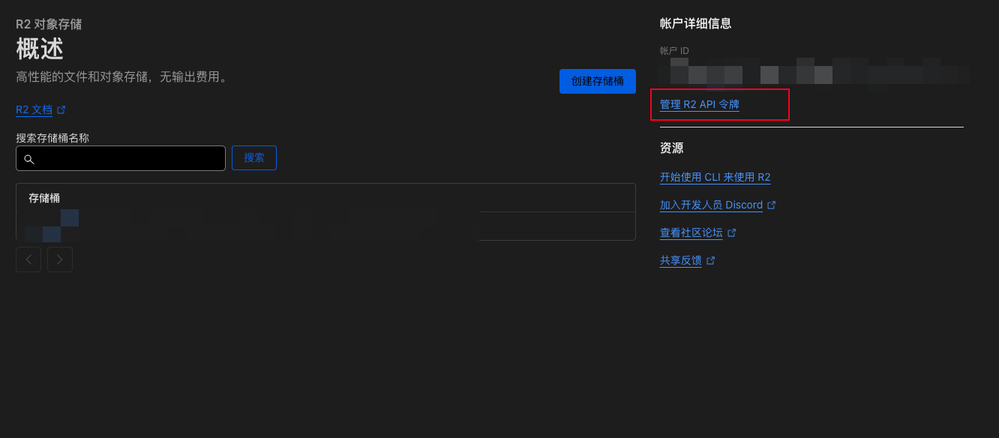
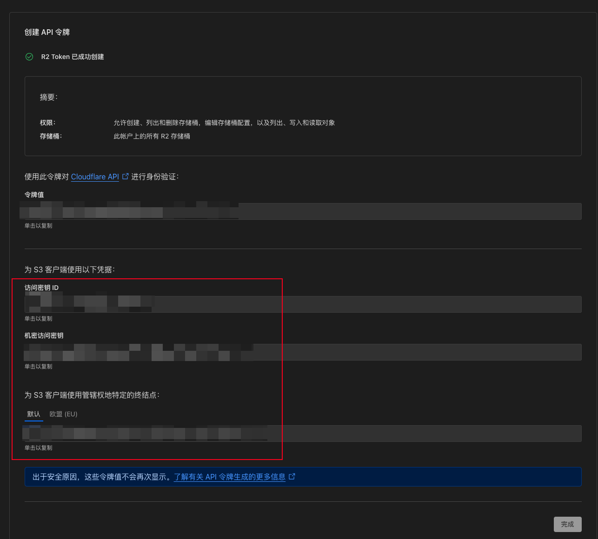
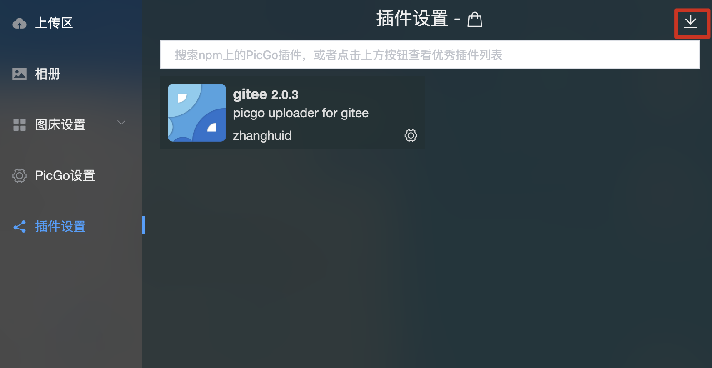
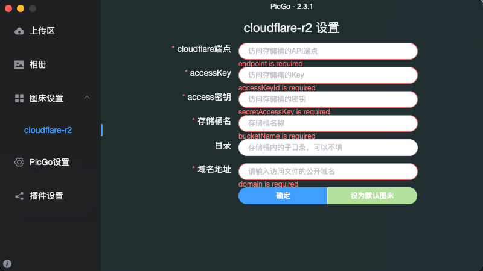
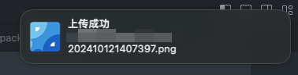
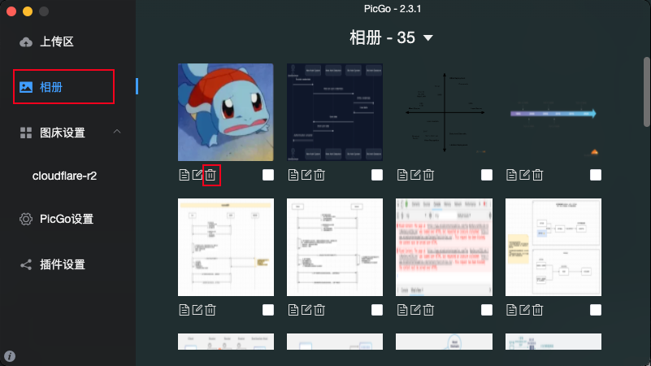
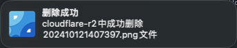

# picgo-plugin-cloudflare-r2-xqv
> picgo for cloudflare-r2 storage

## 食用教程

  0. 已有cloudflare云平台的账号：[cloudflare云平台](https://dash.cloudflare.com/)

  1. cloudflare-r2存储价格，官方文档：[cloudflare-r2 free pricing](https://developers.cloudflare.com/r2/pricing/#free-tier)
      > 截止2024-10-12记录，标准存储桶的免费操作如下
  - 存储：10GB/月
  - A类（更新、删除操作）：100w次/月
  - B类（读取操作）：1000w次/月
  - 流量出口：免费
      > 超出部分自行研究文档：[cloudflare-r2 pricing](https://developers.cloudflare.com/r2/pricing/#r2-pricing)

  2. 设置公开域名或使用clouflare提供的子域名：在存储桶内 - 设置
  
      > 有需要可以开启，我是用的是自己的域名

  3. 创建cloudflare-r2存储桶并创建`R2 API令牌`
  

  
  
      > 记录里面的信息，便于后面使用。密钥ID对应`accessKey`，密钥机密对应`access密钥`，终结点对应`cloudflare端点`；这些后面相关配置

      > 😓 吐槽：经典直译英译汉


## 安装
- 手动安装：下载本项目后
```bash
# 安装依赖
npm i
pnpm i # 👍
# 构建
npm run build
pnpm build
```
- 手动安装picgo插件：如下图，选中目录记录，最后需要**重启**


## 配置


1. cloudflare端点：前面记录的`api终结点`（😓）
2. accessKey: 前面记录的Key
3. access密钥: 前面记录的密钥
4. 存储桶名：创建的存储桶的名称
5. 域名地址：公开访问的域名地址（绑定的域名或cloudflare提供的域名）
6. 目录：保存图片的目录，不填默认上传到存储桶的根目录


## 功能
1. 从剪切板上传到cloudflare-R2


  > 上传成功提示如图

2. 删除上传文件




  > 删除成功如图
